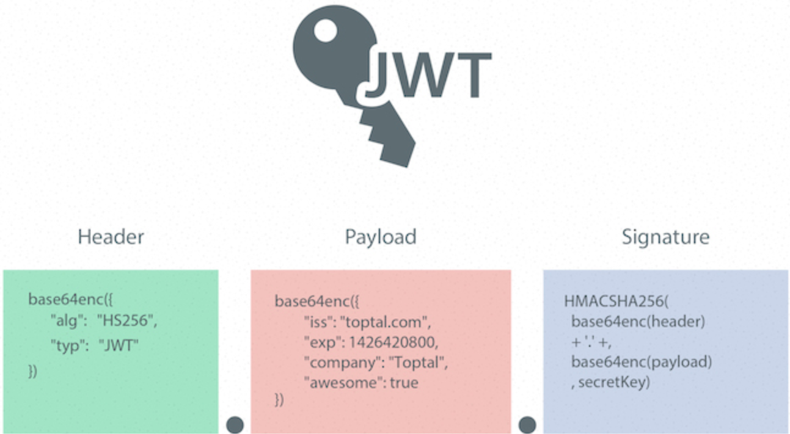
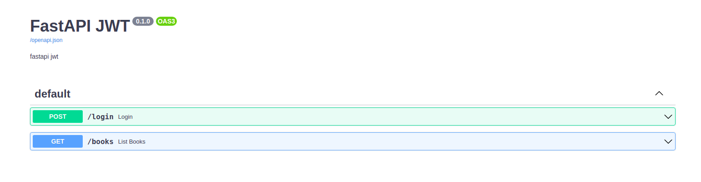
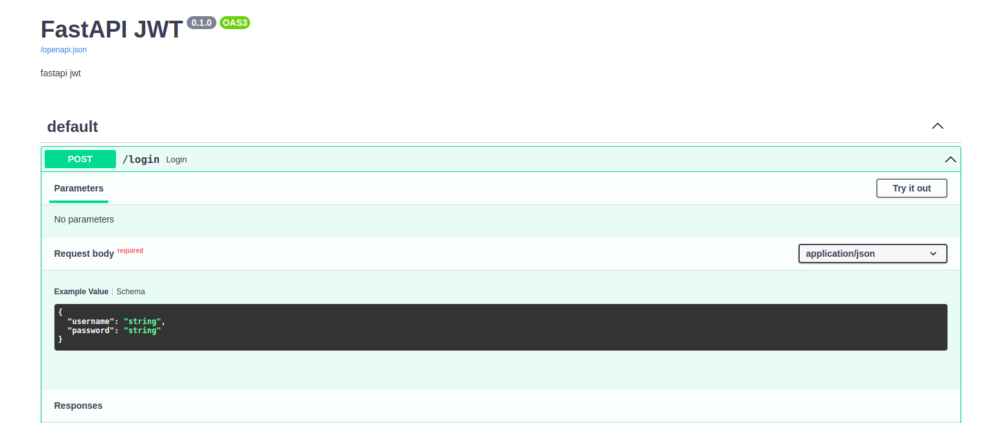
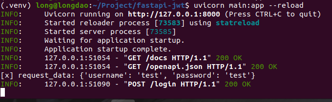
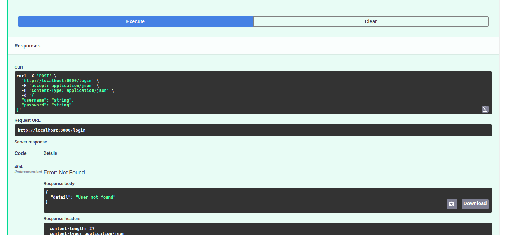
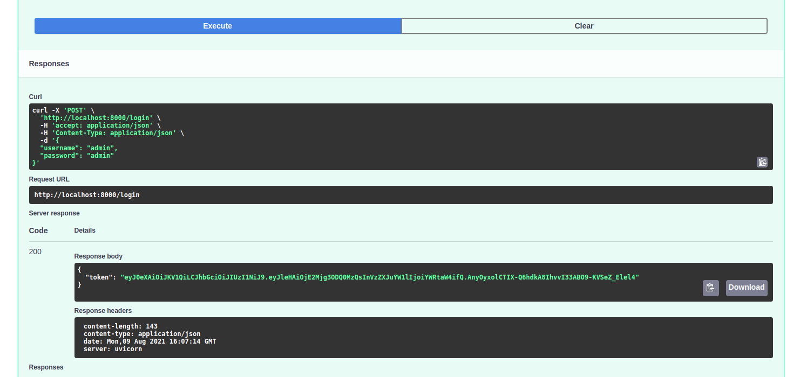
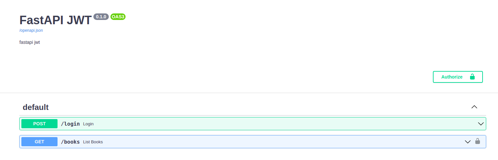

# FastAPI JWT
_Login with json-web-token in Fastapi_


##  Intro: Quick guide to setup login with JWT in Fastapi
Thinking: thông thường các bước xác thực User trong một service backend qua API thường diễn ra như sau:
- User cung cấp username + password và call API login để lấy mã xác thực (JWT token)
- User sử dụng mã xác thực JWT do hệ thống cung cấp, thêm mã này vào trong header của mỗi request để hệ thống check mỗi khi call API

Như chúng ta đã biết hoặc như trang chủ của FastAPI đã viết
> FastAPI is a modern, fast (high-performance), web framework for building APIs with Python 3.6+ based on standard Python type hints.

Ở đây mình sẽ viết một quick setup để cài đặt sử dụng JWT trong FastAPI. Chủ yếu chúng ta có 2 bước:
- Viết API Login để get JWT token
- Viết 1 API get data bất kỳ, required token thì mới get được data

## Step1: Setup a FastAPI service
Đầu tiên, hãy tạo file main.py và thêm vài dòng code để chắc chắn FastAPI chạy được
```
import uvicorn
from fastapi import FastAPI

app = FastAPI(
    title='FastAPI JWT', openapi_url='/openapi.json', docs_url='/docs',
    description='fastapi jwt'
)


@app.post('/login')
def login():
    return 'Success'


@app.get('/books')
def list_books():
    return {'data': ['Sherlock Homes', 'Harry Potter', 'Rich Dad Poor Dad']}


if __name__ == '__main__':
    uvicorn.run(app, host='0.0.0.0', port=8000)
```
Tại giao diện CLI, run command
```
$ uvicorn main:app --reload
```
Open webrowser to check http://localhost:8000/docs

Call thử API xem có ra kết quả không nhé

## Step2: Tạo form login
Sử dụng Pydantic để tạo form login, giờ form login chỉ cần 2 field là username và password.
- Thêm class LoginRequest
- Thêm request_data vào function login.
- Dùng print để show request_data trên CLI
Code
```
...
from pydantic import BaseModel

app = FastAPI(
    title='FastAPI JWT', openapi_url='/openapi.json', docs_url='/docs',
    description='fastapi jwt'
)


class LoginRequest(BaseModel):
    username: str
    password: str


@app.post('/login')
def login(request_data: LoginRequest):
    print(f'[x] request_data: {request_data.__dict__}')
    return 'Success'
...
```
Check webrower, trong request body đã show form rồi 


Click **Try it out**, nhập thử username & password: test/test và check CLI


## Step3: function verify_password
Nhập username, password tất nhiên sẽ cần 1 function để check xem username/password có đúng không, viết 1 function đơn giản check username và password có bằng admin/admin không
```
import uvicorn
from fastapi import FastAPI, HTTPException
from pydantic import BaseModel

...


def verify_password(username, password):
    if username == 'admin' and password == 'admin':
        return True
    return False


@app.post('/login')
def login(request_data: LoginRequest):
    print(f'[x] request_data: {request_data.__dict__}')
    if verify_password(username=request_data.username, password=request_data.password):
        return 'Success'
    else:
        raise HTTPException(status_code=404, detail="User not found")
...
```
Logic là nếu username/password = admin/admin thì return Success, nếu không thì return 404 - User not found  
Test thử trường hợp not found


## Step4: Generate & return token
Khi nhập đúng username/password, api login cần trả ra JWT token, vậy nên giờ ta viết hàm gentoken
- Cài đặt PyJWT, để generate jwt token, ta sử dụng thư viện PyJWT. Open CLI and run:
```
$ pip install PyJWT
```
- Tạo function generate_token, return value của function này thay cho return 'Success'
```
import jwt
import uvicorn

from datetime import datetime, timedelta
from typing import Union, Any
from fastapi import FastAPI, HTTPException
from pydantic import BaseModel

SECURITY_ALGORITHM = 'HS256'
SECRET_KEY = '123456'

...

def generate_token(username: Union[str, Any]) -> str:
    expire = datetime.utcnow() + timedelta(
        seconds=60 * 60 * 24 * 3  # Expired after 3 days
    )
    to_encode = {
        "exp": expire, "username": username
    }
    encoded_jwt = jwt.encode(to_encode, SECRET_KEY, algorithm=SECURITY_ALGORITHM)
    return encoded_jwt


@app.post('/login')
def login(request_data: LoginRequest):
    print(f'[x] request_data: {request_data.__dict__}')
    if verify_password(username=request_data.username, password=request_data.password):
        token = generate_token(request_data.username)
        return {
            'token': token
        }
    else:
        raise HTTPException(status_code=404, detail="User not found")

...
```
Time to test: thử call API và xem kết quả

Kết quả là chuỗi token bao gồm 3 phần

## Step5: Required header Token khi call API books
Để thêm token và check required token, FastAPi đã tích hợp sẵn lib tiện ích là HTTPBearer.
- Trong security.py, thêm reusable_oauth2 là instance của HTTPBearer
- Sử dụng reusable_oauth2 làm dependencies trong API books
```
# security.py
from fastapi.security import HTTPBearer

reusable_oauth2 = HTTPBearer(
    scheme_name='Authorization'
)
```

```
...
from security import validate_token, reusable_oauth2

...

@app.get('/books', dependencies=[Depends(reusable_oauth2)])
def list_books():
    return {'data': ['Sherlock Homes', 'Harry Potter', 'Rich Dad Poor Dad']}
    
...    
```
Quay lại webrowser, có thể thấy biểu tượng khóa và button Authorize ở góc trên bên phải

Call thử API /books mà không nhập token, sẽ thấy response `"detail": "Not authenticated"`

## Step6: validate_token
Sau khi hiểu sơ qua công dụng của HTTPBearer, ta sử dụng nó để get token và check tính hợp lệ
- Trong security.py thêm function validate_token
- Sử dụng validate_token làm dependencies trong API books

```
from datetime import datetime

import jwt
from fastapi import Depends, HTTPException
from fastapi.security import HTTPBearer
from pydantic import ValidationError

SECURITY_ALGORITHM = 'HS256'
SECRET_KEY = '123456'

reusable_oauth2 = HTTPBearer(
    scheme_name='Authorization'
)


def validate_token(http_authorization_credentials=Depends(reusable_oauth2)) -> str:
    """
    Decode JWT token to get username => return username
    """
    try:
        payload = jwt.decode(http_authorization_credentials.credentials, SECRET_KEY, algorithms=[SECURITY_ALGORITHM])
        if payload.get('username') < datetime.now():
            raise HTTPException(status_code=403, detail="Token expired")
        return payload.get('username')
    except(jwt.PyJWTError, ValidationError):
        raise HTTPException(
            status_code=403,
            detail=f"Could not validate credentials",
        )

```

```
...
from security import validate_token
...

@app.get('/books', dependencies=[Depends(validate_token)])
def list_books():
    return {'data': ['Sherlock Homes', 'Harry Potter', 'Rich Dad Poor Dad']}

...
```
Quay lại webrowser, call APi login để get token và nhập token đó để call API /books xem sao nhé.  

## Conclusion
Tích hợp JWT vào FastAPI khá là đơn giản, điều quan trọng là chúng ta cần biết sử dụng **HTTPBearer** và **dependencies** là những công cụ có sẵn được cung cấp bởi framework.  
Ngoài ra nếu được có thể tìm hiểu cơ chế hoạt động của lib **PyJWT**

